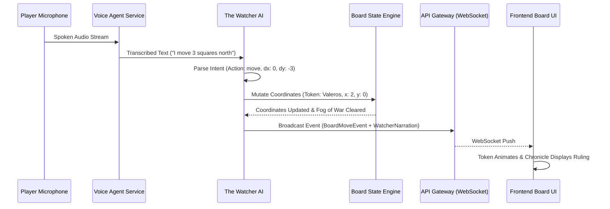

# Explanation: Realtime Voice and Tactical Board Synchronization

## Low Friction Storytelling: Speak and the Board Obeys

The goal of Runefoble is to provide the lowest friction tabletop experience in the world:
- Players should not spend game night looking down at coordinate spreadsheets or dragging tokens across screens.
- Players speak naturally: *"I charge three squares forward to intercept the skeleton."*
- The platform transcribes, extracts spatial intent, validates physics, animates the board, and updates the narrative chronicle in real time.

## Pipeline Architecture

## Latency Budgets
- **Audio Capture & Streaming**: < 100ms
- **Speech-to-Text Transcription**: < 200ms
- **Intent Parsing & Validation**: < 150ms
- **WebSocket Broadcast & Client Render**: < 50ms
- **Total Roundtrip**: < 500ms
This sub-second loop allows conversational spontaneity without noticeable lag.
