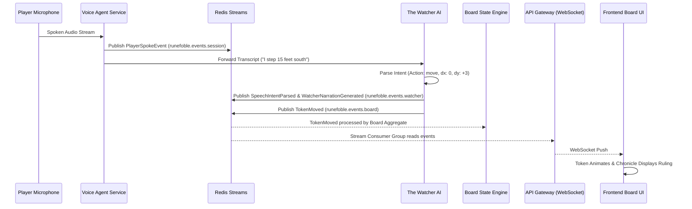

# Explanation: Realtime Voice and Tactical Board Synchronization

## Low Friction Storytelling: Speak and the Board Obeys

The goal of Runefoble is to provide the lowest friction tabletop experience in the world:
- Players should not spend game night looking down at coordinate spreadsheets or dragging tokens across screens.
- Players speak naturally: *"I charge three squares forward to intercept the skeleton."*
- The platform transcribes, extracts spatial intent, validates physics, animates the board, and updates the narrative chronicle in real time.

## Pipeline Architecture

## Intent Parsing Capabilities
The Watcher heuristic speech-to-intent engine delivers sub-10ms interpretation with fallback to LLM inference:
1. **Cardinal & Distance Movement**: Handles both distance-first ("step 15 feet south", "move 3 squares north", "advance 2 east", "retreat 1 west") and direction-first phrasing. Automatically scales feet to grid squares at 5 feet per square.
2. **Absolute Coordinates**: Directly maps coordinate targets like "move to 5, 8" into tactical grid positions clamped to board boundaries.
3. **Token Engagement & Flanking**: Recognizes tactical positioning commands like "move to the goblin archer" and "flank the skeleton".
4. **Combat Actions**: Identifies melee and ranged attacks ("attack goblin with longsword"), spell invocations ("cast fireball at 4, 6"), and skill checks ("stealth check").

## Latency Budgets
- **Audio Capture & Streaming**: < 100ms
- **Speech-to-Text Transcription**: < 200ms
- **Intent Parsing & Validation**: < 50ms (local heuristic < 5ms, remote LLM worker < 200ms)
- **Redis Stream Event Dispatch**: < 10ms
- **WebSocket Broadcast & Client Render**: < 50ms
- **Total Roundtrip**: < 500ms
This sub-second loop allows conversational spontaneity without noticeable lag.

