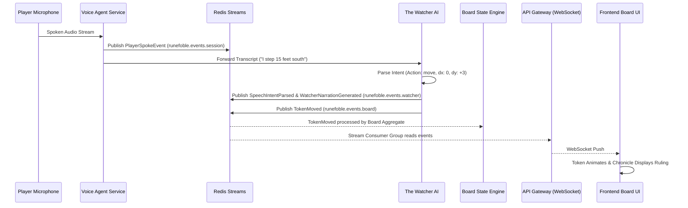
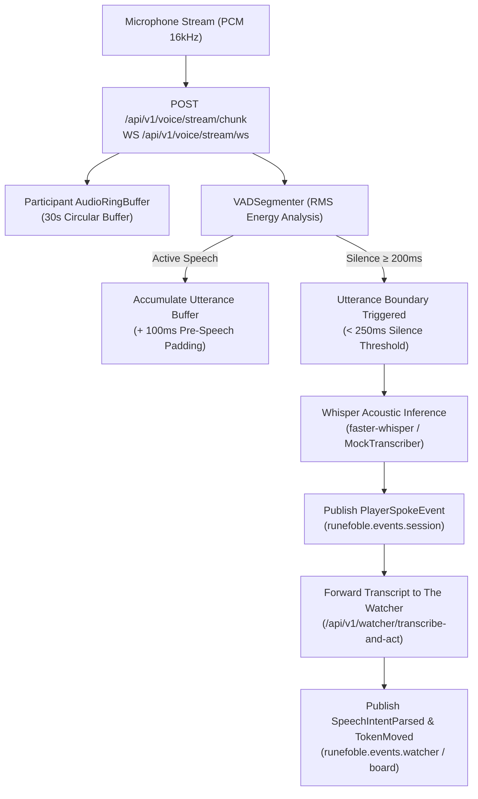

# Explanation: Realtime Voice and Tactical Board Synchronization

## Low Friction Storytelling: Speak and the Board Obeys

The goal of Runefoble is to provide the lowest friction tabletop experience in the world:
- Players should not spend game night looking down at coordinate spreadsheets or dragging tokens across screens.
- Players speak naturally: *"I charge three squares forward to intercept the skeleton."*
- The platform transcribes, extracts spatial intent, validates physics, animates the board, and updates the narrative chronicle in real time.

## Pipeline Architecture

## Intent Parsing Capabilities
The Watcher heuristic speech-to-intent engine delivers sub-10ms interpretation with fallback to LLM inference:
1. **Cardinal & Distance Movement**: Handles both distance-first ("step 15 feet south", "move 3 squares north", "advance 2 east", "retreat 1 west") and direction-first phrasing. Automatically scales feet to grid squares at 5 feet per square.
2. **Absolute Coordinates**: Directly maps coordinate targets like "move to 5, 8" into tactical grid positions clamped to board boundaries.
3. **Token Engagement & Flanking**: Recognizes tactical positioning commands like "move to the goblin archer" and "flank the skeleton".
4. **Combat Actions**: Identifies melee and ranged attacks ("attack goblin with longsword"), spell invocations ("cast fireball at 4, 6"), and skill checks ("stealth check").

## Streaming Audio Ingestion & VAD Segmentation Pipeline

To achieve true zero-friction interaction, Runefoble transitions from batch speech recording to continuous streaming audio ingestion:

### 1. Participant Ring Buffers (`AudioRingBuffer`)
Each active voice participant maintains an isolated, bounded circular ring buffer storing up to 30 seconds of 16-bit 16kHz mono PCM frames (960 kB). Audio frames are appended asynchronously without blocking real-time voice streaming or audio playback pipelines.

### 2. Sub-250ms Voice Activity Detection (`VADSegmenter`)
- **Subframe Energy Analysis**: Ingested PCM audio is segmented into 20ms analysis windows (320 samples / 640 bytes). Root-mean-square (RMS) amplitude is calculated to detect vocal phonemes against background acoustic silence.
- **Pre-Speech Buffering**: A 100ms circular pre-speech buffer ensures initial plosives and unvoiced consonants (e.g., /p/, /t/, /k/, /s/) are preserved when transitioning into speech.
- **Utterance Completion Detection**: When continuous silence exceeds 200ms (strictly within the < 250ms silence detection budget), the VAD marks the utterance boundary as completed, extracts the accumulated speech window, and hands off to acoustic inference.

### 3. Whisper Acoustic Inference & Event Dispatch
- **Acoustic Transcription**: The completed audio segment is transcribed via `FasterWhisperTranscriber` (CTranslate2 INT8 tiny.en/base.en model) or deterministic `MockWhisperTranscriber` in test environments.
- **CloudEvent Publication**: An immutable `PlayerSpokeEvent` is dispatched onto Redis Streams (`runefoble.events.session`).
- **Watcher Orchestration**: The transcript is concurrently delivered to `the_watcher` for spatial intent extraction and board action execution (`SpeechIntentParsed`, `WatcherNarrationGenerated`, and `TokenMoved`).

## WebRTC Voice Room Signaling Gateway Architecture

Bidirectional voice streams and audio mesh coordination are negotiated via the WebSocket endpoint at `/ws/voice/{session_id}`. In accordance with Hard Invariant 6 (File length limit < 500 lines) and ADR-0003 / ADR-0007, the signaling infrastructure in `gateway_api` is partitioned into modular, single-responsibility submodules under `gateway_api/signaling/`:

- **Signaling Connection Manager (`gateway_api.signaling.manager`)**:
  `WebRTCSignalingManager` tracks active room WebSockets, peer lookups, disconnect cleanup, and directed or broadcast JSON frame transmission.
- **Signaling Zanzibar Auth (`gateway_api.signaling.auth`)**:
  `extract_signaling_auth` extracts credentials across query parameters (`user_id`, `token`) and headers (`X-User-Id`, `Authorization: Bearer`), while `validate_voice_connection` queries SpiceDB Zanzibar to enforce session participation or campaign access before granting room admission.
- **Signaling Message Handlers (`gateway_api.signaling.handlers`)**:
  Dedicated dispatchers handle `webrtc_offer`, `webrtc_answer`, and `webrtc_ice_candidate` routing, `webrtc_mute` state toggles, `webrtc_telemetry` broadcasts, and graceful `webrtc_leave` teardowns.
- **WebSocket Endpoint (`gateway_api.signaling.endpoint`)**:
  `voice_signaling_websocket_endpoint` coordinates the connection lifecycle, sends initial `connected` and `webrtc_joined` frames, runs the dispatch loop, and handles unexpected disconnects.
- **Backward-Compatible Facade (`gateway_api.webrtc_signaling`)**:
  Re-exports all signaling components to guarantee zero contract regressions across legacy imports.

## WebRTC Client Voice Service and Peer Connection Mesh Architecture

On the browser client, real-time voice streaming and peer mesh topology are managed by modular TypeScript services in `frontend/src/services/` (TASK-0068, ADR-0002, ADR-0004, ADR-0009, ADR-0013):

- **WebRTC Protocol Types & Interfaces (`frontend/src/services/webrtc-types.ts`)**:
  Defines strongly typed wire signaling contracts (`SignalingMessage`), active voice participant snapshots (`VoicePeer`), client configuration options (`WebRTCVoiceOptions`, `PeerMeshOptions`), and connection state enums (`WebRTCConnectionState`, `WebRTCConnectionStates`).
- **Peer Connection Mesh Coordinator (`frontend/src/services/webrtc-peer-mesh.ts`)**:
  `PeerConnectionMesh` manages the lifecycle of `RTCPeerConnection` instances across party peers. It implements early ICE candidate queuing prior to remote description resolution, tracks remote audio MediaStreams, bridges local audio tracks, and attaches remote streams to managed DOM `<audio>` elements with per-peer volume and mute controls.
- **Voice Client Service Facade (`frontend/src/services/webrtc-voice.ts`)**:
  `WebRTCVoiceService` provides the public client interface. It establishes Zanzibar-authorized WebSocket signaling sessions with `gateway-api`, orchestrates auto-reconnect timers, coordinates the local `WebAudioPipeline` (hardware microphone capture, DSP vocal conditioning filters, and VAD audio levels), and periodically broadcasts speaking telemetry.
- **Backward Compatibility**:
  `webrtc-voice.ts` re-exports all protocol types and `PeerConnectionMesh`, ensuring seamless compatibility with existing frontend components, Storybook stories, and microfrontend consumers.

## Campaign WebSocket Hub and Action Validator Gateway Architecture

Real-time campaign mutations, token movement broadcasts, health modifications, and Watcher notifications stream through `/ws/campaigns/{campaign_id}`. In accordance with Hard Invariant 6 (File length limit < 500 lines) and ADR-0001 / ADR-0007 / ADR-0009, the WebSocket infrastructure in `gateway_api` is partitioned into modular, single-responsibility submodules:

- **Zanzibar Action Validator (`gateway_api.websocket_validator`)**:
  `WebSocketActionValidator` executes fine-grained SpiceDB Zanzibar permission checks (`campaign:view`, `campaign:read`, `board_token:move`, `character:edit`, `dungeon_master`). It enforces DM bypass privileges, movement authorization, and blocks non-DM encounter mutations.
- **Connection Hub Manager (`gateway_api.websocket_manager`)**:
  `CampaignConnectionManager` (and backward-compatible alias `CampaignWebSocketManager`) tracks active client connections per campaign and handles JSON broadcast dispatching across connected party members.
- **Credential & Handshake Auth (`gateway_api.websocket_auth`)**:
  `extract_token_from_websocket` and `extract_subject_id` extract JWT credentials across query parameters, `Authorization: Bearer` headers, and `Sec-WebSocket-Protocol` subprotocol headers, validating signatures via `ZitadelAuthService` in production.
- **WebSocket Routing Endpoint (`gateway_api.websocket_endpoint`)**:
  `campaign_websocket_endpoint` manages the WebSocket handshake lifecycle, validates viewer connection permissions, dispatches incoming actions to Redis Streams (`runefoble.events.board`, `runefoble.events.session`, `runefoble.events.watcher`), and coordinates disconnect cleanup.
- **Backward-Compatible Facade (`gateway_api.websocket`)**:
  Re-exports all validator, manager, auth, and endpoint symbols ensuring zero contract regressions for existing callers and tests.

## Latency Budgets
- **Audio Capture & Streaming**: < 100ms
- **VAD Segmentation & Boundary Trigger**: < 200ms (< 250ms silence detection)
- **Speech-to-Text Transcription**: < 100ms (faster-whisper tiny.en / mock < 15ms)
- **Intent Parsing & Validation**: < 50ms (local heuristic < 5ms, remote LLM worker < 200ms)
- **Redis Stream Event Dispatch**: < 10ms
- **WebSocket Broadcast & Client Render**: < 40ms
- **Total End-to-End Voice-to-Board Latency**: < 500ms

This sub-500ms loop fulfills the foundational system promise: *Speak and the board obeys*.

