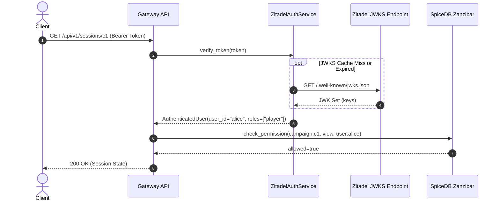

# How-To: Authenticate Users with Zitadel OIDC and JWTs

## Overview
Runefoble integrates with self-hosted Zitadel (`ghcr.io/zitadel/zitadel`) to provide OIDC identity management, user authentication, and project role mapping. Authenticated user IDs extracted from Zitadel RS256 JWTs serve directly as Zanzibar `subject_id` identifiers in SpiceDB.

## Architecture & Verification Flows

1. **User Login**: The frontend client redirects to Zitadel (`/auth`) via PKCE flow.
2. **Token Issuance**: Zitadel issues an RS256-signed JWT containing `sub` (User ID), `email`, and project roles (`urn:zitadel:iam:org:project:roles`).
3. **Gateway Verification**: `gateway-api` retrieves Zitadel's public JSON Web Key Sets (JWKS) via `jwt.PyJWKClient`, verifies the RS256 cryptographic signature, validates expiration (`exp`) and audience (`aud`), and extracts the authenticated subject.
4. **Zanzibar Check**: The verified `user_id` is supplied to SpiceDB client dependencies to verify fine-grained permissions.



---

## Step 1: Verify Tokens in `ZitadelAuthService`

Use `ZitadelAuthService` from `libs/runefoble_auth`:

```python
from runefoble_auth.zitadel import AuthenticatedUser, ZitadelAuthService

# Initialize service pointing to internal Zitadel issuer
auth_service = ZitadelAuthService(
    issuer="http://zitadel:8080",
    client_id="runefoble-api",
    jwks_cache_ttl=300,  # 5 minutes JWKS cache
    verify_audience=True,
)

# Cryptographically verify RS256 signature against cached JWKS
user: AuthenticatedUser = auth_service.verify_token(bearer_token)
print(f"Authenticated user: {user.username} ({user.user_id})")
print(f"Assigned roles: {user.roles}")
```

### Offline & Development Mode Bypass
In local unit tests or offline environments where Zitadel is not running, set `RUNEFOBLE_AUTH_DEV_MODE=true` (or instantiate `ZitadelAuthService(dev_mode=True)`) or pass `verify=False` to `verify_token` to bypass JWKS network lookups and fall back to local mock contexts (`dev-user-001`).

---

## Step 2: Enforce Authentication in Gateway HTTP Endpoints

FastAPI endpoints enforce authentication and Zanzibar permissions via `require_zanzibar_permission` and `get_current_user`:

```python
from typing import Annotated
from fastapi import APIRouter, Depends
from gateway_api.auth import get_current_user, require_zanzibar_permission
from runefoble_auth.zitadel import AuthenticatedUser

router = APIRouter()


@router.get("/api/v1/profile")
async def get_profile(user: Annotated[AuthenticatedUser, Depends(get_current_user)]):
    return {
        "user_id": user.user_id,
        "username": user.username,
        "email": user.email,
        "roles": user.roles,
        "is_admin": user.is_admin,
    }


@router.get(
    "/api/v1/sessions/{session_id}",
    dependencies=[Depends(require_zanzibar_permission("view", resource_type="campaign"))],
)
async def get_session(session_id: str):
    return {"id": session_id, "status": "active"}
```

In production mode (`RUNEFOBLE_AUTH_DEV_MODE=false`), requests lacking a valid Bearer token or presenting spoofed `X-User-Id` headers receive `HTTP 401 Unauthorized`.

---

## Step 3: Authenticate Real-Time WebSocket Handshakes

For real-time connections (`/ws/campaigns/{campaign_id}`), clients send the token as a query parameter (`?token=...`) or `Authorization: Bearer <token>` header:

```python
from fastapi import HTTPException, WebSocket
from gateway_api.auth import get_zitadel_auth_service
from gateway_api.websocket import default_action_validator, extract_token_from_websocket


async def campaign_websocket_endpoint(websocket: WebSocket, campaign_id: str):
    auth_service = get_zitadel_auth_service()
    token = extract_token_from_websocket(websocket)

    if token:
        try:
            user = auth_service.verify_token(token)
            subject_id = user.user_id
        except Exception as exc:
            raise HTTPException(
                status_code=401,
                detail=f"Token verification failed: {exc}",
            ) from exc
    elif auth_service.dev_mode:
        subject_id = websocket.query_params.get("user_id", "guest")
    else:
        raise HTTPException(status_code=401, detail="Authentication required: missing token")

    # Verify SpiceDB Zanzibar permissions
    can_connect = await default_action_validator.validate_connect(campaign_id, subject_id)
    if not can_connect:
        await websocket.accept()
        await websocket.send_json({"type": "error", "code": "PERMISSION_DENIED"})
        await websocket.close(code=4003)
        return

    await websocket.accept()
```
