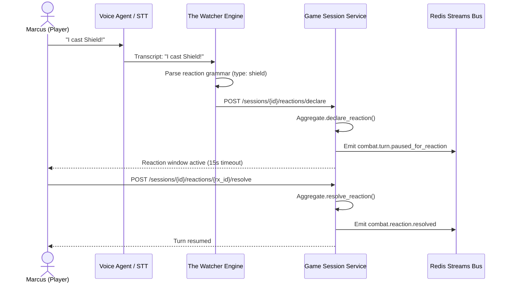

# How-To: Manage Spoken Reaction Interrupts and Ready-Action Triggers

This guide explains how players halt ongoing combat turns with spoken reaction keywords ("Shield!", "Counterspell!", "Opportunity Attack!") and declare conditional ready actions that trigger automatically on combat events (ADR-0002, ADR-0006, ADR-0007, ADR-0011).

---

## 1. Architecture & Sub-500ms Turn Interruption

In digital tabletop combat, rigid sequential turns prevent reactive play. Runefoble resolves this via event-driven reaction interrupts:
1. **Spoken Intent Recognition**: Natural speech captured from players is parsed by `the_watcher` reaction grammar.
2. **Turn Pause & Reaction Window**: `game_session` immediately halts active turn timers, emits `combat.turn.paused_for_reaction` (`runefoble.events.combat.turn_paused_for_reaction`) over Redis Streams, and prompts the reacting player.
3. **Reaction Resolution**: The player confirms or dismisses the reaction via REST endpoint, emitting `combat.reaction.resolved` and resuming active combat turn flow.



---

## 2. Spoken Reaction Intent Grammar

The reaction intent parser (`services/the_watcher/src/the_watcher/intent/reactions.py`) recognizes core TTRPG reaction phrases:

| Spoken Phrase | Extracted Reaction Type | Action Type | Default AC / Spell Bonus |
|---|---|---|---|
| `"Shield!"` / `"I cast Shield"` | `shield` | `reaction` | AC +5 |
| `"Counterspell!"` / `"Counterspell that"` | `counterspell` | `reaction` | Level 3 Abjuration |
| `"Opportunity attack on the goblin"` | `opportunity_attack` | `reaction` | Target: `goblin` |
| `"Absorb Elements!"` | `absorb_elements` | `reaction` | Elemental resistance |
| `"Hellish Rebuke on the cultist"` | `hellish_rebuke` | `reaction` | Target: `cultist` |
| `"I use Uncanny Dodge"` | `uncanny_dodge` | `reaction` | Half damage |
| `"I ready my crossbow to shoot if the goblin enters"` | `ready_action` | `ready_action` | Trigger: `enemy_enters_range` |

---

## 3. Ready-Action Conditional Registry

Players can declare conditional ready actions on their turn. The conditional registry (`ReadyActionRegistry`) evaluates incoming combat events against active triggers:

- **Movement / Spatial Triggers**: Triggered when a token traverses grid cells (`TokenMoved`).
- **Spellcasting Triggers**: Triggered when a hostile creature casts a kinetic spell (`SpellCast`).
- **Attack Triggers**: Triggered when a creature initiates an attack action (`TokenActionExecuted`).

When matched, the registry emits `combat.ready_action.triggered` and executes the readied action.

---

## 4. REST API Reference

### Declare Reaction Interrupt
```http
POST /sessions/{session_id}/reactions/declare
Content-Type: application/json

{
  "reacting_combatant_id": "char-marcus-101",
  "reacting_combatant_name": "Marcus",
  "trigger_phrase": "I cast Shield!",
  "reaction_type": "shield",
  "timeout_seconds": 15.0,
  "details": { "spell": "Shield", "ac_bonus": 5 }
}
```

### Register Ready Action
```http
POST /sessions/{session_id}/reactions/ready-action
Content-Type: application/json

{
  "combatant_id": "char-marcus-101",
  "combatant_name": "Marcus",
  "trigger_type": "enemy_enters_range",
  "trigger_condition": "if the goblin steps into the hallway",
  "readied_action": "shoot crossbow",
  "target_id": "token-goblin-raider",
  "range_cells": 6
}
```

### Resolve Reaction Interrupt
```http
POST /sessions/{session_id}/reactions/{reaction_id}/resolve
Content-Type: application/json

{
  "action_taken": "cast_shield",
  "details": { "applied_ac": 5 }
}
```

### Query Active Reaction State
```http
GET /sessions/{session_id}/reactions/active
```
