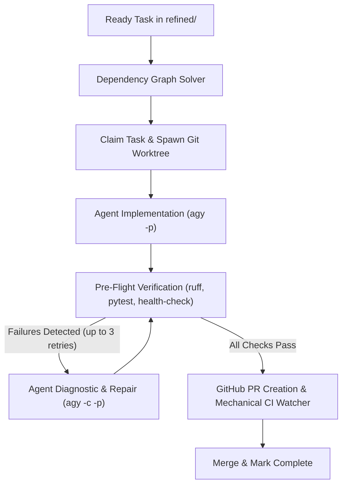

# How-To: Run the Autonomous Backlog Execution Engine

## Overview
The Autonomous Backlog Execution Engine (`tools/backlog_engine`) automatically claims unblocked, refined tasks from `docs/project/backlog/refined/`, runs implementation agents in isolated Git worktrees, executes mechanical pre-flight verification, creates GitHub Pull Requests, and uses a deterministic mechanical CI watcher to await green status and merge.

## Running the Engine

### 1. Dry Run (Inspect Queue & Unblocked Tasks)
To see which tasks are currently unblocked and ready to be processed without executing:
```bash
make backlog-worker ARGS="--dry-run"
# or: ./scripts/run-backlog-engine.sh --dry-run
```

### 2. Autonomous Queue Draining (Default)
By default, the engine continuously drains the queue, executing ready unblocked tasks and advancing through the backlog:
```bash
./scripts/run-backlog-engine.sh
```

### 3. Parallel Execution Streams
Run multiple concurrent worker streams in parallel isolated worktrees (with thread-safe worktree isolation and resilient CI conflict recovery):
```bash
./scripts/run-backlog-engine.sh --concurrency 3
```

### 4. Single-Batch Execution (`--once`)
To execute only a single batch of tasks up to concurrency and exit without continuous draining:
```bash
./scripts/run-backlog-engine.sh --once
# or: ./scripts/run-backlog-engine.sh --concurrency 3 --once
```

### 5. Local Offline Merge Mode
For local development or environments without remote GitHub push permissions:
```bash
./scripts/run-backlog-engine.sh --local
```

## How the Pipeline Operates


1. **Dependency Resolution**: Inspects task frontmatter (`dependencies: [...]`). Tasks remain blocked until all dependencies have been moved to `complete/`.
2. **Worktree Isolation**: Each worker stream creates `.worktrees/task-XXXX` on branch `feat/XXXX`.
3. **Agent Worker & Self-Healing Repair Loop**:
   - The worker runs non-interactively via `agy -p`.
   - Comprehensive pre-flight verification executes `uv run ruff check .`, `uv run ruff format --check .`, `uv run pytest`, and codebase health invariants.
   - If any verification check fails, the orchestrator does not discard work. Instead, it aggregates all failure logs into a diagnostic prompt and feeds it back to the agent using session continuation (`agy -c -p`), allowing the agent to diagnose errors, reformat code, resolve failing tests, or decompose oversized files.
4. **Mechanical CI Watcher & Conflict Detection**:
   - Zero tokens are spent polling CI. GitHub checks are watched mechanically via `gh pr checks`.
   - Pull request mergeability and conflict status (`mergeable: CONFLICTING`, `mergeStateStatus: DIRTY`) are checked via `gh pr view`. If a PR encounters merge conflicts with the base branch or is closed, the watcher fails immediately rather than treating missing checks as a pending queue job, closes the conflicting PR, and releases the task back to the ready queue.
   - Pre-push sync inspects whether `origin/main` moved forward while the worker was implementing, testing clean mergeability with `git merge-tree` to prevent conflicting PRs from reaching GitHub.
5. **Queue Reconciliation**: Upon merge, the task is moved from `refined/` to `complete/`, updating `docs/project/backlog/PRIORITY.md` and `ROADMAP.md` automatically.

## Fault Tolerance & Graceful Interrupts

- **Graceful Cancellation (`Ctrl+C`)**: When interrupted with `Ctrl+C`, the engine terminates running agent processes, removes active git worktrees, and immediately releases all claimed tasks back to `Refined` so they remain ready for execution.
- **Startup Stale Task Recovery**: In case of a hard termination (e.g. machine restart or SIGKILL), the orchestrator scans `docs/project/backlog/refined/` upon launch and automatically resets any orphaned `in-progress` or `review` tasks back to `Refined` (clearing `claimed_by` and `pr_url`), ensuring no task is ever lost.
- **Max Retry Limits (3 Attempts)**: If a task encounters unresolvable pre-flight failures or persistent conflicts, it is retried up to 3 times before being safely skipped for the current session, allowing the orchestrator to continue draining the backlog without hanging or crashing.
- **Thread-Safe Worktree Lifecycle & Rebase Retries**: Worktree creation, cleanup, and git index mutations are protected by threading locks to eliminate lock collisions during concurrent execution. Non-fast-forward push rejections during completion commits are automatically recovered with atomic rebase retries.

## Verifying the Engine Test Suites

The autonomous backlog execution engine is verified via modular frontdoor test suites conforming to Hard Invariant 6 (< 500 lines per file):
- [`test_backlog_parser.py`](file:///home/ty/workspace/runefoble/tests/test_backlog_parser.py): Validates task markdown syntax, YAML frontmatter schemas, octal safety, title fallback, and Definition of Done parsing.
- [`test_backlog_queue.py`](file:///home/ty/workspace/runefoble/tests/test_backlog_queue.py): Validates priority ranking, topological dependency resolution, circular dependency detection, and queue transitions.
- [`test_backlog_execution.py`](file:///home/ty/workspace/runefoble/tests/test_backlog_execution.py): Validates atomic state progression (`claim` -> `review` -> `complete`), preflight quality gate aggregation, self-healing repair loops, and interrupt rollbacks.
- [`test_backlog_ci_watcher.py`](file:///home/ty/workspace/runefoble/tests/test_backlog_ci_watcher.py): Validates PR mergeability, dirty conflict status checks, immediate conflict abortion, and failed CI log extractions.
- [`test_backlog_stale_recovery.py`](file:///home/ty/workspace/runefoble/tests/test_backlog_stale_recovery.py): Validates orphaned in-progress/review task recovery, requeuing mechanics, worktree threading locks, and failure retry circuit breakers.
- [`test_backlog_pr_repair.py`](file:///home/ty/workspace/runefoble/tests/test_backlog_pr_repair.py): Validates pre-push git merge-tree conflict detection, orchestrator PR teardown on CI failure, and automated worktree AI agent PR healing.

Run the test suite via pytest:
```bash
uv run pytest tests/test_backlog_*.py
```

