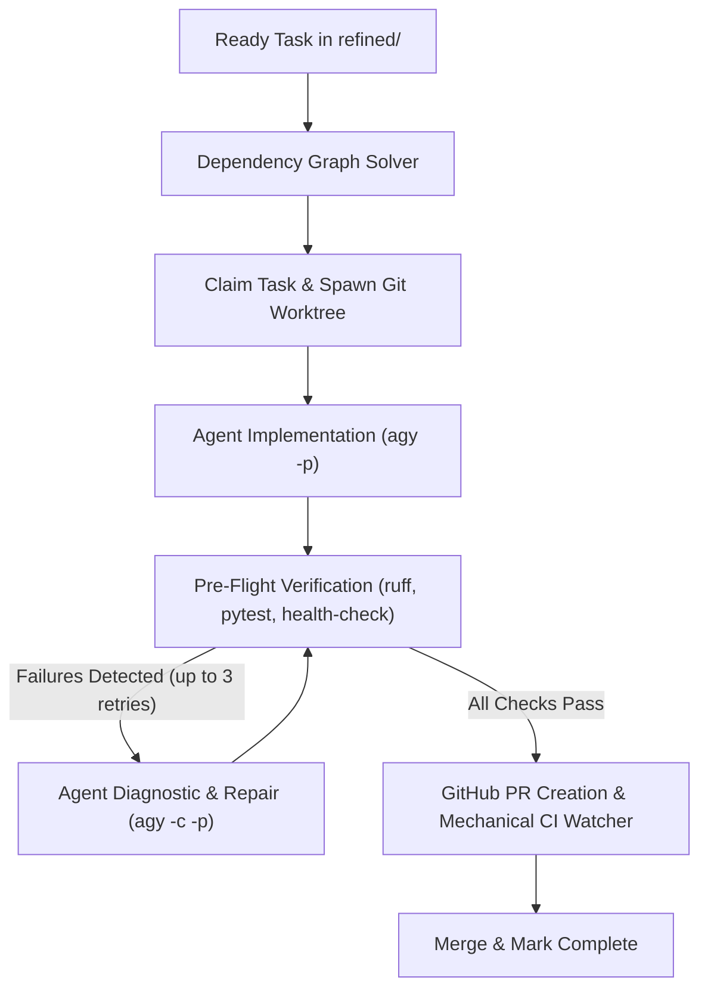

# How-To: Run the Autonomous Backlog Execution Engine

## Overview
The Autonomous Backlog Execution Engine (`tools/backlog_engine`) automatically claims unblocked, refined tasks from `docs/project/backlog/refined/`, runs implementation agents in isolated Git worktrees, executes mechanical pre-flight verification, creates GitHub Pull Requests, and uses a deterministic mechanical CI watcher to await green status and merge.

## Running the Engine

### 1. Dry Run (Inspect Queue & Unblocked Tasks)
To see which tasks are currently unblocked and ready to be processed without executing:
```bash
make backlog-worker ARGS="--dry-run"
# or: ./scripts/run-backlog-engine.sh --dry-run
```

### 2. Single-Task Execution (Default)
Picks the highest-priority ready, unblocked task, runs it in an isolated worktree, creates a PR, verifies CI, merges it to `main`, and marks the task Complete:
```bash
./scripts/run-backlog-engine.sh
```

### 3. Queue Draining Mode
Keeps looping and processing tasks until no unblocked ready tasks remain in the queue:
```bash
./scripts/run-backlog-engine.sh --drain
```

### 4. Parallel Execution Streams
Run multiple concurrent worker streams in parallel isolated worktrees:
```bash
./scripts/run-backlog-engine.sh --concurrency 2 --drain
```

### 5. Local Offline Merge Mode
For local development or environments without remote GitHub push permissions:
```bash
./scripts/run-backlog-engine.sh --local
```

## How the Pipeline Operates


1. **Dependency Resolution**: Inspects task frontmatter (`dependencies: [...]`). Tasks remain blocked until all dependencies have been moved to `complete/`.
2. **Worktree Isolation**: Each worker stream creates `.worktrees/task-XXXX` on branch `feat/XXXX`.
3. **Agent Worker & Self-Healing Repair Loop**:
   - The worker runs non-interactively via `agy -p`.
   - Comprehensive pre-flight verification executes `uv run ruff check .`, `uv run ruff format --check .`, `uv run pytest`, and codebase health invariants.
   - If any verification check fails, the orchestrator does not discard work. Instead, it aggregates all failure logs into a diagnostic prompt and feeds it back to the agent using session continuation (`agy -c -p`), allowing the agent to diagnose errors, reformat code, resolve failing tests, or decompose oversized files.
4. **Mechanical CI Watcher**: Zero tokens are spent polling CI. GitHub checks are watched mechanically via `gh pr checks`.
5. **Queue Reconciliation**: Upon merge, the task is moved from `refined/` to `complete/`, updating `docs/project/backlog/PRIORITY.md` and `ROADMAP.md` automatically.
