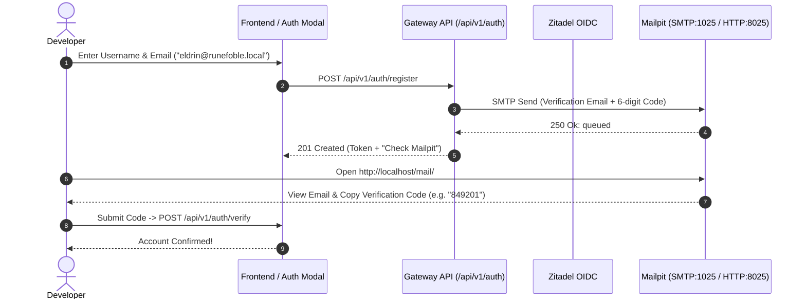

# How-To: Test Email Signups with Mailpit Mock SMTP

## Overview

Runefoble integrates **Mailpit** (`axllent/mailpit`) as the platform's local mock SMTP server and email testing dashboard. During local development, all user registrations, Zitadel OIDC account verifications, password resets, and party invitations route through Mailpit instead of public email relays.

Mailpit provides:
1. **Zero External Dependencies**: Traps 100% of outgoing emails in local memory/ephemeral storage.
2. **Web UI**: Interactive inbox accessible directly at `http://localhost/mail/` or `http://runefoble.local/mail/`.
3. **REST API**: Automated test inspection via `/api/v1/messages` and `/api/v1/search`.
4. **Zitadel Integration**: Out-of-the-box wiring so Zitadel's verification emails land in Mailpit automatically.

---

## Architecture & Verification Flow

When a player or DM signs up, the authentication gateway or Zitadel dispatches an RFC-822 email over internal SMTP (`mailpit:1025`). Mailpit captures the email and makes it immediately visible in its Web UI and REST API.



---

## Step 1: Access the Mailpit Web UI

Once the local cluster is running (`make cluster-up` and `make helm-deploy`), Traefik ingress routes the Mailpit web interface:

- **Ingress URL**: [http://localhost/mail/](http://localhost/mail/) or [http://runefoble.local/mail/](http://runefoble.local/mail/)
- **Alternative Path**: [http://localhost/mailpit/](http://localhost/mailpit/)
- **Internal Cluster Address**: `http://mailpit:8025`

The Mailpit interface displays:
- List of captured messages with search and tags
- Raw headers, plain text, and rendered HTML email tabs
- Mobile vs desktop view previews
- Link inspector highlighting all actionable links

---

## Step 2: Trigger an Email Signup

You can trigger a user registration through the browser frontend (`<runefoble-auth-modal>`) or via `curl`:

```bash
curl -X POST http://localhost/api/v1/auth/register \
  -H "Content-Type: application/json" \
  -d '{
    "username": "ThorinOakenshield",
    "email": "thorin@runefoble.local",
    "password": "EreborReclaimed2026!"
  }'
```

Response:
```json
{
  "user_id": "user-thorinoakenshield",
  "username": "ThorinOakenshield",
  "email": "thorin@runefoble.local",
  "roles": ["player"],
  "access_token": "eyJhbGciOi...",
  "verification_required": true,
  "message": "Verification email dispatched to thorin@runefoble.local. View email in Mailpit at http://localhost/mail/"
}
```

---

## Step 3: Complete Account Verification

Open [http://localhost/mail/](http://localhost/mail/) and inspect the latest message with subject:
`Welcome to Runefoble! Confirm your adventurer account`.

You can verify the account using either the 6-digit code or the activation link:

### Option A: Verify via 6-digit Code
```bash
curl -X POST http://localhost/api/v1/auth/verify \
  -H "Content-Type: application/json" \
  -d '{
    "email": "thorin@runefoble.local",
    "code": "481516"
  }'
```

### Option B: Verify via Activation Token
```bash
curl -X POST http://localhost/api/v1/auth/verify \
  -H "Content-Type: application/json" \
  -d '{
    "email": "thorin@runefoble.local",
    "token": "<token-from-email>"
  }'
```

---

## Step 4: Automated Testing with `MailpitClient`

In Python integration tests and blackbox test suites, use `MailpitClient` from `runefoble_platform`:

```python
from runefoble_platform.email_client import MailpitClient

# Initialize client (uses PlatformSettings defaults)
mailpit = MailpitClient()

# Purge inbox before test for isolation
await mailpit.delete_all_messages()

# Send test email or trigger registration endpoint
await mailpit.send_email(
    to="valeros@runefoble.local",
    subject="Welcome to Runefoble",
    body_text="Your code is: 928371",
)

# Inspect captured messages
latest = await mailpit.get_latest_message()
assert latest is not None
assert "valeros@runefoble.local" in latest.to

# Extract code and activation link using built-in helpers
code = MailpitClient.extract_verification_code(latest.text)
assert code == "928371"

link = MailpitClient.extract_verification_link(latest.text)
```

### Offline & In-Memory Fallback
In local unit tests where the Mailpit container is not active, `MailpitClient` automatically falls back to an in-memory buffer (`fallback_in_memory=True`), recording sent emails and allowing queries without network socket failures.

---

## Step 5: Test SMTP Delivery Manually

To verify that SMTP connectivity is operational from the command line:

```bash
curl -X POST http://localhost/api/v1/auth/test-email \
  -H "Content-Type: application/json" \
  -d '{
    "to": "test@runefoble.local",
    "subject": "Manual SMTP Test",
    "body": "Checking Mailpit delivery pipeline."
  }'
```

Check the Mailpit service health status at any time:
```bash
curl http://localhost/api/v1/auth/mailpit/status
```

Response:
```json
{
  "status": "healthy",
  "http_available": true,
  "smtp_available": true,
  "message_count": 1,
  "web_ui_url": "http://localhost:8025/mail/"
}
```

---

## Step 6: Seed Local Dev Admin & Invite Users

For local development and testing, you can provision the default administrator or invite new team members with specific roles:

### 1. Automatic Seeding via Helm
When the Kind cluster initializes with Helm (`make helm-deploy`), the Zitadel deployment automatically provisions the initial administrator using values from `deployments/helm/runefoble/values.yaml`:
- **Username**: `admin`
- **Email**: `admin@runefoble.local`
- **Password**: `RunefobleAdminPassword123!`

### 2. Manual CLI Seeding
To provision or re-verify the default dev admin and send a credentials reminder to Mailpit:
```bash
make seed-admin
```
Or via script:
```bash
uv run python3 scripts/invite_admin.py --seed
```

### 3. Inviting an Admin or Dungeon Master
To invite a developer or tester as an admin or DM:
```bash
make invite-admin ARGS="--email dm-elena@runefoble.local --name Elena --role dm"
```
Or via HTTP API:
```bash
curl -X POST http://localhost/api/v1/auth/admin/invite \
  -H "Content-Type: application/json" \
  -d '{
    "email": "dm-elena@runefoble.local",
    "username": "Elena",
    "role": "dm"
  }'
```

This immediately:
1. Grants Zanzibar role relationships in SpiceDB (`system:runefoble#game_master@user:user-elena`).
2. Dispatches an invitation email with an activation token to Mailpit (`http://localhost/mail/`).
3. Allows the recipient to complete signup by clicking the link in the Mailpit inbox.

