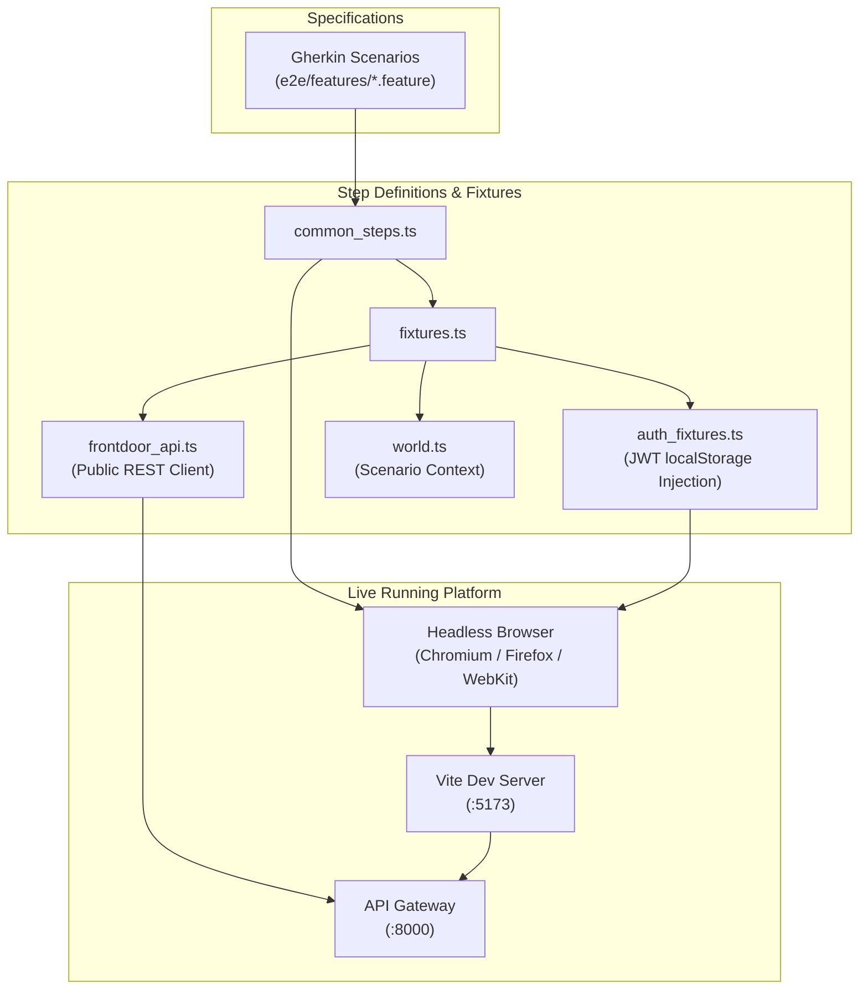
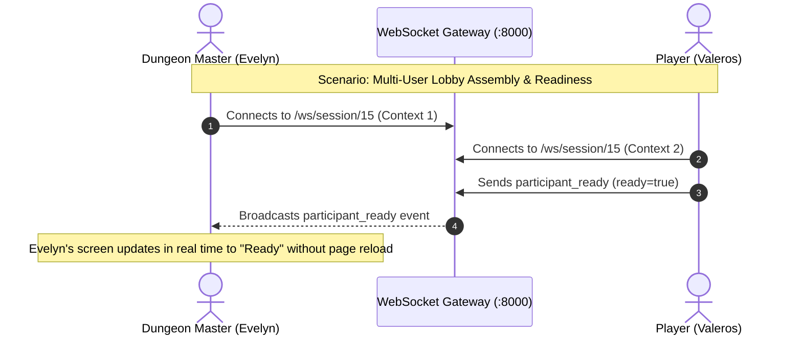

# How-To: Validate End-to-End User Journeys with Playwright BDD

## Overview

Runefoble validates complete user journeys spanning decoupled Lit Web Component microfrontends, SPA routing, Shadow DOM custom events, real-time WebSockets, and backend microservices using **Playwright** (`@playwright/test`) and **Behavior-Driven Development (BDD)** via `playwright-bdd`.

Governed by **ADR-0014** and **Hard Invariant 7 (Blackbox TDD with Frontdoor Setup)**, tests are authored as executable Gherkin feature files (`e2e/features/**/*.feature`) and executed strictly against public entrypoints with **zero backdoor state or database manipulation**.

---

## Architecture & Frontdoor Test Harness

The BDD testing harness resides in `e2e/` and `playwright.config.ts`:

```
e2e/
├── features/         # Gherkin .feature specifications
│   └── smoke.feature
├── steps/            # Playwright step definitions
│   └── common_steps.ts
└── support/          # Frontdoor test fixtures & world context
    ├── auth_fixtures.ts
    ├── fixtures.ts
    ├── frontdoor_api.ts
    └── world.ts
```



---

## 1. Frontdoor Authentication Fixture

Under **Hard Invariant 7**, test runners must never reach directly into the database or mock internal service state. The frontdoor auth fixture (`e2e/support/auth_fixtures.ts`) creates valid Zitadel JWT credentials and injects them directly into the browser's `localStorage`:

```typescript
// Inject DM session before page scripts load
Given('I am logged in as a {string}', async ({ auth, world }, roleOrName: string) => {
  const user = await auth.injectUser(roleOrName);
  world.currentUser = user;
});
```

The fixture sets:
- `rf_auth_session`: JSON session payload containing access and refresh tokens, user profile, and Zanzibar roles.
- `runefoble-access-token`: Bearer access token for HTTP and WebSocket requests.
- `runefoble-user`: Profile metadata.

Supported personas:
- `"DM"`: Dungeon Master (`user-dm-eldrin`, roles `['dm', 'player']`, admin status).
- `"Player"`: Standard player (`user-valeros`, role `['player']`).
- `"Spectator"`: Passive audience member (`user-spectator-zephyr`, role `['spectator']`).

---

## 2. Frontdoor API Helper

Preconditions are prepared through public HTTP REST endpoints using `FrontdoorApi` (`e2e/support/frontdoor_api.ts`):

```typescript
Given('campaign {string} exists', async ({ frontdoorApi, world }, campaignTitle: string) => {
  const token = world.currentUser?.token;
  const campaign = await frontdoorApi.createCampaign(campaignTitle, { token });
  world.campaignId = campaign.id;
  world.campaignTitle = campaign.title;
});
```

---

## 3. Playwright Configuration & WebServer Automation

`playwright.config.ts` automatically manages development servers:
- **Base URL**: `http://localhost:5173`
- **Browser Matrix**: Desktop Chromium, Firefox, WebKit
- **Failure Artifacts**: Traces on first retry, video recordings on failure, full-page screenshots
- **WebServers**: Automatically launches `gateway/api/src/gateway_api/main.py` (:8000) and `pnpm run dev` (:5173) if not already running.

---

## 4. Developer Makefile Targets

Three standard targets are available in the root `Makefile`:

### Run Headless E2E Test Suite
Executes the full BDD test suite across Chromium, Firefox, and WebKit:
```bash
make test-e2e
```

To run against a specific browser or filter by scenario name:
```bash
make test-e2e ARGS="--project=chromium -g 'Theme'"
```

### Validate Gherkin Syntax and Steps
Generates test files and validates that all Gherkin steps map to step definitions without launching browsers:
```bash
make test-bdd
```

### Interactive UI Mode
Launches the interactive Playwright UI with time-travel DOM inspection and network recording:
```bash
make test-e2e-ui
```

---

## 5. Shadow DOM Locator Conventions

Runefoble uses Lit Web Components. Playwright's locator engine automatically pierces open Shadow DOM boundaries without requiring special locators:

```typescript
// Pierces shadow DOM of runefoble-header to find h1
await expect(page.getByRole('heading', { name: 'Runefoble' })).toBeVisible();

// Pierces shadow DOM of runefoble-theme-switcher to find active theme button
const themeBtn = page.locator('runefoble-theme-switcher button.theme-button.active');
await expect(themeBtn).toBeVisible();
```

---

## 6. Multi-Browser Concurrent Sessions & Real-Time Tabletop VTT Verification

For features involving synchronized collaborative workflows—such as session lobby readiness, absentee AI stand-in toggles, dynamic session launch transitions, and real-time token kinematics—Playwright runs multiple isolated `BrowserContext` instances within a single scenario.

### Dual-Context Architecture



### Implementing Multi-Context Step Definitions

Step definitions in `e2e/steps/vtt_steps.ts` leverage `browser.newContext()` and the custom `World` helper to maintain separate pages per participant:

```typescript
// Evelyn hosts session in default context
Given('{word} is hosting session {string} for campaign {string}', async ({ page, world }, user, session, campaign) => {
  await injectUserIntoPage(page, user.toLowerCase());
  world.setPage(user, page);
  await page.goto(`/#/campaigns/${campaign}/sessions/${session}`);
});

// Valeros joins in a separate browser context
Given('{word} joins {string} in a separate browser', async ({ browser, world }, user, session) => {
  const context = await browser.newContext({ baseURL: 'http://localhost:5173' });
  world.extraContexts.push(context);
  const userPage = await context.newPage();
  await injectUserIntoPage(userPage, user.toLowerCase());
  world.setPage(user, userPage);
  await userPage.goto(`/#/campaigns/4/sessions/${session}`);
});
```

### Verifying Token Kinematics and Movement Sync

Token dragging dispatches standard pointer and custom DOM events or UI interactions on `<runefoble-board>`, triggering WebSocket broadcasts over `/ws/session/{id}`:

```typescript
// Drag token on Player screen
await playerPage.locator('runefoble-board').dispatchEvent('token-move', {
  detail: { tokenId: 'token-valeros', x: 3, y: 3 }
});

// Verify smooth coordinate update on DM screen
await expect(dmPage.locator('runefoble-board')).toContainText('3, 3');

// Verify chronicle feed reflection
await expect(dmPage.locator('runefoble-watcher-feed')).toContainText('moved to (3, 3)');
```

