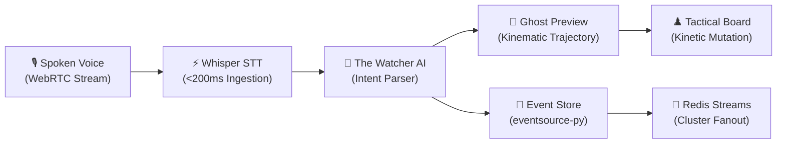

# Runefoble: Speak and the Board Obeys

<div class="hero-banner" markdown style="padding: 1.5rem; background: linear-gradient(135deg, rgba(79, 70, 229, 0.12) 0%, rgba(147, 51, 234, 0.08) 100%); border-radius: 12px; border: 1px solid rgba(79, 70, 229, 0.25); margin-bottom: 2rem;">

### Next-Generation Collaborative Tabletop Roleplaying
**Runefoble** unites the boundless creativity of tabletop roleplaying with the speed and immersion of modern AI. By transforming natural human speech into tactile tactical mutations in under 500 milliseconds, Runefoble eliminates the friction of manual bookkeeping while preserving the irreplaceable soul of collaborative storytelling.

[🚀 Explore Project Visualizer](project-visualizer.md){ .md-button .md-button--primary }
[🎨 Storybook Component Studio](storybook-studio.md){ .md-button }
[📖 View Changelog](changelog.md){ .md-button }

</div>

---

## 🎲 The Tabletop Dilemma & The Runefoble Solution

Every roleplaying group confronts three fundamental barriers to consistent, magical game nights:

<div class="grid cards" markdown>

-   :material-clock-alert: **The DM Prep Burden**

    ---

    Game Masters spend 4–8 hours preparing maps, memorizing 400-page rulebooks, and balancing encounter math for every session, leading to inevitable DM burnout.

    **The Runefoble Solution**: **The Watcher AI** acts as an autonomous co-pilot or full Game Master—handling scene descriptions, monster tactics, line-of-sight, and rule queries in milliseconds.

-   :material-calendar-remove: **The Missing Player Curse**

    ---

    When one player cannot attend, games are frequently postponed for weeks, eroding narrative momentum and causing campaigns to wither and die.

    **The Runefoble Solution**: Autonomous **AI Stand-Ins** pilot absent characters with customizable tactical playstyles, flavored with playful session miss penalties (*"Drunk"*, *"Foolishness"*).

-   :material-cursor-default-click: **Clunky VTT Interfaces**

    ---

    Modern virtual tabletops feel like dense spreadsheet applications—forcing players to click through nested menus, enter numbers, and fiddle with tokens rather than living in the fiction.

    **The Runefoble Solution**: **"Speak and the board obeys."** Natural spoken conversation directly mutates the tactical board, triggers animations, and casts spells.

</div>

---

## ⚡ What Exists Today: Live Core Capabilities

Runefoble is built as an enterprise-grade, cloud-native gaming engine. The foundational loop is fully operational across our microservices and Lit Web Component frontend:



### 1. Tactile Kinetic Board & Spoken Ghost Previews
- **Instant Spoken Commands**: Speak naturally (*"Valeros rushes 20 feet south behind the crumbling pillar and readies his shield"*); the intent engine parses movement, destination, and combat stances in under 500ms.
- **Kinematic Ghost Previews**: Real-time semi-transparent token trajectories and spell area-of-effect templates preview the route before mutations commit to the board.
- **Physical Drag-and-Drop Momentum**: Tokens behave with physical weight, spring damping, velocity, real-time 5-foot waypoint distance measurement, and terrain hazard validation.
- **Dynamic Fog of War & Silo S3 Maps**: Battlemaps uploaded to Silo (S3 storage) dynamically reveal fog of war based on individual token vision radii and lighting conditions.

### 2. The Watcher: Autonomous DM & Human Co-Pilot
- **The Assistant, Never the Dictator**: When a human Game Master is running the session, The Watcher operates as an invisible co-pilot—whispering monster strategy suggestions, setting atmospheric mood notes, and tracking initiative. The human DM retains instantaneous override and veto authority.
- **Autonomous DM Mode**: For groups without a dedicated DM, The Watcher runs complete sessions—pacing scenes, arbitrating rules, describing consequences, and roleplaying NPCs.
- **Absentee AI Stand-Ins**: Missing players are piloted by AI stand-ins that honor the character's stat sheet, spell inventory, and battle personality.
- **Flavorful Session Miss Penalties**: DMs can inflict lighthearted status conditions on stand-ins (such as *"Drunk"* with slurred speech and reckless bravado, or *"Foolishness"*), followed by an automated narrative recap reel when the player returns.

### 3. Real-Time Audio DSP & Voice Personas
- **WebRTC Collaborative Audio Rooms**: High-fidelity bidirectional voice chat connects players and AI agents with live audio visualizer waveforms.
- **Dynamic Vocal Conditioning**: Status conditions trigger real-time WebAudio DSP filters—inflicting drunken slurs, spectral ghostly echoes, or muffled underwater acoustics.
- **Persona Synthesis**: Distinct AI voice profiles deliver deep, mystical Game Master narration and memorable NPC voices.

### 4. Zero-Trust Security & Distributed Architecture
- **Google Zanzibar Object Authorization**: SpiceDB relationship-based access control enforces object permissions across campaigns, character sheets, battlemaps, and spectator views (`runefoble.zed`).
- **Zitadel OIDC Authentication**: Enterprise-grade identity verification across HTTP REST routes, FastMCP tool gateways, and WebSocket streams.
- **Decoupled Microfrontends**: UI components are vendored inside their bounded context (`services/<bc>/ui/`) with Shadow DOM encapsulation and discoverable via `/ui/manifest`.
- **Bauhaus Design System**: High-contrast, WCAG 2.1 AA compliant themes featuring Dark, Light, and System preference modes configured via a centralized modal.
- **OpenTelemetry & OpenPanel**: End-to-end distributed tracing across all services and privacy-preserving product telemetry.

---

## 🗺️ Where We're Going: The Multi-Horizon Roadmap

Guided by our Product Requirement Records (PRDs) and user stories, Runefoble's active roadmap bridges immediate alpha polish with ambitious long-term horizons:

<div class="grid cards" markdown>

-   ### 📍 Milestone 2: Live Collaborative Alpha *(Current)*
    ---
    *Focus: Core Gameplay Loop, Board Kinematics & Platform Resilience*

    - [x] Sub-500ms Whisper speech-to-intent pipeline (`TASK-0039`)
    - [x] Tactile kinetic board kinematics & spoken ghost previews (`TASK-0084`)
    - [x] Microfrontend component vendoring & `/ui/manifest` discovery (`ADR-0013`)
    - [x] WebRTC voice streaming & Silo S3 battlemap uploading (`TASK-0030`, `TASK-0031`)
    - [x] SpiceDB Zanzibar authorization & Zitadel OIDC synchronization (`TASK-0032`, `TASK-0035`)
    - [x] OpenTelemetry tracing & OpenPanel analytics pipeline (`TASK-0037`, `TASK-0038`)
    - [x] Centralized settings modal with Dark/Light mode orchestration (`TASK-0073`)
    - [ ] High-contrast WCAG 2.1 AA semantic color tokens across components (`TASK-0074`)

-   ### 🚀 Milestone 3: AI DM & Ecosystem Expansion *(Next)*
    ---
    *Focus: Deep Worldbuilding, Generative Assets & Dynamic Soundscapes*

    - [ ] **Campaign Lore Vector RAG (`campaign_lore`)**: Ingest custom lorebooks, faction agendas, and NPC webs with `redstring` hybrid retrieval for sub-50ms contextual recall (`PRD-0007`, `US-0036`).
    - [ ] **Rules Compendium & CR Encounter Builder (`rules_compendium`)**: Sub-50ms canonical SRD rule queries and automated combat difficulty balance calculations (`PRD-0008`, `US-0037`).
    - [ ] **Procedural Generative Battlemaps**: Synthesize tactical battlemaps and tokens on-the-fly from DM spoken descriptions into Silo S3 (`PRD-0009`, `US-0038`).
    - [ ] **Adaptive Tension Foley & Dynamic Score**: Generative music and ambient soundscapes that dynamically shift between peaceful campfires and high-stakes boss encounters (`PRD-0010`, `US-0039`).
    - [ ] **Conversational Disambiguation & Compound Voice Actions**: Multi-turn dialog resolving ambiguous player intents and natural wake-word activation (`US-0021`, `US-0024`).
    - [ ] **Personalized Voice Cloning & Hot-Swap Takeover**: AI stand-ins speaking in absent players' cloned voices, with instant zero-downtime hot-swap when players rejoin (`US-0026`, `US-0028`).

-   ### 🌌 Milestone 4: Broadcast Studio & Community Platform *(Future)*
    ---
    *Focus: Live Audience Interactivity, Streaming Tools & Universal VTT*

    - [ ] **Live Spectator Studio & Audience Chaos Polls**: Allow Twitch/YouTube viewers to vote on wild magic surges, tavern brawls, and environmental weather hazards (`PRD-0011`, `US-0031`).
    - [ ] **Cinematic Auto-Camera & OBS Transparent Overlays**: Automated broadcast director following combat focus with real-time party vitals overlays (`US-0029`, `US-0030`).
    - [ ] **Campaign Living Chronicle & Combat Telemetry**: Interactive timeline maps, character kill ledgers, and exportable campaign recap books (`PRD-0012`, `US-0040`).
    - [ ] **Universal VTT Importer & MCP Hot-Reloading**: Seamlessly import campaigns from Foundry VTT, Roll20, and Fantasy Grounds with dynamic MCP plugin reloading (`US-0033`, `US-0035`).

</div>

---

## 🔬 Architectural Transparency & Engineering Rigor

Runefoble is engineered with uncompromising architectural standards designed for reliability, modularity, and rapid development:

| Architectural Pillar | Specification / Implementation | Key Benefit |
|---|---|---|
| **Language & Environment** | Python 3.13 + UV Monorepo Workspace | Sub-second dependency resolution, unified workspace lockfile |
| **Event Sourcing** | `eventsource-py` on PostgreSQL | Pure domain aggregates, complete audit history, time-travel debugging |
| **Distributed Messaging** | Redis Streams Consumer Groups | Distributed fanout across bounded context microservices |
| **Object Authorization** | SpiceDB Google Zanzibar (`runefoble.zed`) | Zero-trust object-level permissions, auditable campaign security |
| **Frontend Architecture** | Lit Web Components + Shadow DOM | Microfrontend vendoring without monolithic framework lock-in |
| **Design System** | Bauhaus Modernist Tokens (CSS Variables) | High contrast, accessible Dark/Light modes, zero CSS bleed |
| **Agent Interface** | Model Context Protocol (FastMCP) Gateway | Native LLM tool invocation for dice rolls, board moves, and lore queries |
| **Cloud Infrastructure** | Kubernetes Kind + Umbrella Helm Chart | Reproducible local clusters and single-command cloud deployments |

---

## 🛠️ Interactive Exploration & Documentation Hub

Explore the platform through our built-in interactive tools and comprehensive documentation:

<div class="grid cards" markdown>

-   :material-graph: **[Interactive Project Visualizer](project-visualizer.md)**

    ---

    Interact with our live 2D force-directed graph, DAG dependency tree, radar view, and Kanban pipeline tracking every ADR, PRD, and backlog task.

-   :material-palette: **[Storybook UI Studio](storybook-studio.md)**

    ---

    Test drive every Lit Web Component in visual isolation across themes, viewport breakpoints, and mock states.

-   :material-history: **[Platform Changelog](changelog.md)**

    ---

    Review every platform release, milestone deliverable, and unreleased capability documented according to Keep a Changelog.

-   :material-school: **[Local Development Tutorial](tutorials/01-local-development-setup.md)**

    ---

    Spin up a local Kind cluster, deploy the full Helm stack, and start developing in less than five minutes.

-   :material-file-document-multiple: **[Architectural Decision Records](project/adrs/REGISTRY.md)**

    ---

    Browse our accepted ADRs governing Zanzibar auth, event sourcing, microfrontends, and speech processing.

-   :material-clipboard-check: **[Agent Operating Manual](operating-manual.md)**

    ---

    Read the Definition of Ready (DoR), Definition of Done (DoD), and file length invariants governing code quality.

</div>

---

## 🚀 Get Started

Ready to experience or contribute to Runefoble?

```bash
# Clone and inspect the repository
git clone https://github.com/tyevans/runefoble.git
cd runefoble

# Launch local Kind Kubernetes cluster with Traefik ingress
make cluster-up

# Deploy the complete microservice stack via Helm
make helm-deploy

# Launch the hot-reloading frontend
make dev-frontend
```

*Runefoble is open source and designed for storytellers, game masters, players, and developers worldwide.*
