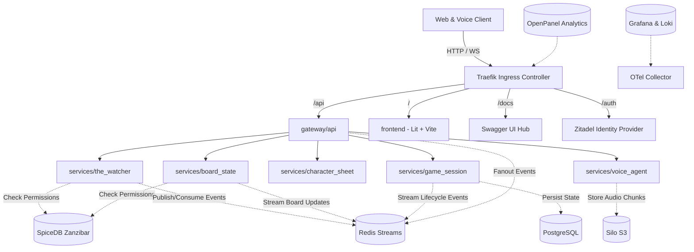

# Architecture Overview

## System Context Diagram

## Bounded Contexts

| Bounded Context | Path | Responsibilities |
|---|---|---|
| `runefoble_platform` | `libs/runefoble_platform` | Common configuration, base models, error hierarchy, event bus |
| `runefoble_auth` | `libs/runefoble_auth` | Zitadel JWT decoding, SpiceDB Zanzibar client & `runefoble.zed` schema |
| `runefoble_events` | `libs/runefoble_events` | CloudEvents-compliant event definitions for real-time storytelling |
| `the_watcher` | `services/the_watcher` | AI DM arbitration, speech-to-intent parsing, missing player stand-ins |
| `board_state` | `services/board_state` | Tactical grid, token coordinates, movement validation, fog of war |
| `character_sheet` | `services/character_sheet` | Character stats, HP, inventory, DM absence penalties ("drunk", "foolishness") |
| `game_session` | `services/game_session` | Active sessions, turns, round management, player presence |
| `voice_agent` | `services/voice_agent` | Audio streaming, STT/TTS pipeline, persona voice models |
| `gateway_api` | `gateway/api` | API Gateway, WebSocket fanout, OpenAPI spec aggregation |
| `gateway_mcp` | `gateway/mcp` | Model Context Protocol server exposing RPG tools to AI models |
| `frontend` | `frontend/` | Lit web components, Vite app, Storybook design system |
