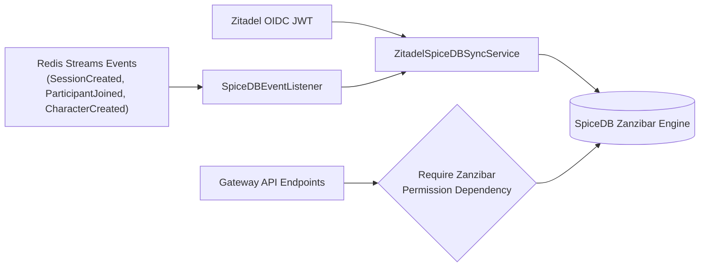

# Reference: SpiceDB Zanzibar Relationship Synchronization with Zitadel Identities

## Overview

Runefoble enforces object-level access control via Google Zanzibar schema on SpiceDB (`libs/runefoble_auth/schema/runefoble.zed`). The Zitadel-to-SpiceDB synchronization bridge translates authenticated Zitadel OIDC identities, role assignments, and domain events into Zanzibar relationship tuples without manual administrator intervention.



## Zanzibar Schema Model (`runefoble.zed`)

```zed
definition user {}

definition campaign {
    relation owner: user
    relation dungeon_master: user
    relation gm: user
    relation player: user
    relation spectator: user

    permission manage = owner
    permission run_session = owner + dungeon_master + gm
    permission play = run_session + player
    permission view = play + spectator
}

definition character {
    relation campaign: campaign
    relation owner: user

    permission edit = owner + campaign->run_session
    permission view = edit + campaign->view
}

definition game_session {
    relation campaign: campaign

    permission control = campaign->run_session
    permission participate = campaign->play
    permission observe = campaign->view
}

definition session {
    relation campaign: campaign

    permission control = campaign->run_session
    permission participate = campaign->play
    permission observe = campaign->view
}

definition board_token {
    relation campaign: campaign
    relation character: character

    permission move = character->edit + campaign->run_session
    permission inspect = campaign->view
}
```

## Relationship Tuples Mapped by ZitadelSync

| Trigger / Claim | SpiceDB Relationship Tuple | Meaning |
|---|---|---|
| User claim role `gm` / `dm` | `campaign:<id>#gm@user:<sub_id>`<br/>`campaign:<id>#dungeon_master@user:<sub_id>` | Grants DM / GM powers: `run_session`, `edit`, `move`, atmosphere mutation |
| User claim role `player` | `campaign:<id>#player@user:<sub_id>` | Grants session participation and board viewing |
| User claim role `spectator` | `campaign:<id>#spectator@user:<sub_id>` | Grants read-only observation (`view`, `inspect`) |
| Character aggregate binding | `character:<char_id>#owner@user:<sub_id>`<br/>`character:<char_id>#campaign@campaign:<id>` | Binds character to owning player and campaign |
| Session aggregate binding | `session:<sess_id>#campaign@campaign:<id>` | Inherits campaign authorization policies onto the active session |
| Board token binding | `board_token:<token_id>#character@character:<char_id>`<br/>`board_token:<token_id>#campaign@campaign:<id>` | Enforces that only character owner or GM can move the token |

## Public Synchronization Endpoints

All endpoints are hosted on the API Gateway under `/api/v1/auth/sync`:

### 1. `POST /api/v1/auth/sync/user`
Synchronizes user identity claims or bearer JWT claims into SpiceDB identity tuples for an optional target campaign.

**Request Body:**
```json
{
  "user_id": "adventurer_robin",
  "username": "Robin",
  "roles": ["player"],
  "campaign_id": "camp-101",
  "token": "optional-raw-jwt-token"
}
```

**Response (200 OK):**
```json
{
  "status": "synchronized",
  "user_id": "adventurer_robin",
  "username": "Robin",
  "synced_relationships": [
    "campaign:camp-101#player@user:adventurer_robin"
  ]
}
```

### 2. `POST /api/v1/auth/sync/membership`
Grants or revokes campaign/session membership roles (`gm`, `dungeon_master`, `player`, `spectator`, `owner`).

**Request Body:**
```json
{
  "campaign_id": "camp-101",
  "user_id": "gm_elena",
  "role": "gm",
  "action": "grant"
}
```

**Response (200 OK):**
```json
{
  "status": "membership_updated",
  "campaign_id": "camp-101",
  "user_id": "gm_elena",
  "role": "gm",
  "action": "grant",
  "synced_relationships": [
    "campaign:camp-101#gm@user:gm_elena",
    "campaign:camp-101#dungeon_master@user:gm_elena"
  ]
}
```

### 3. `POST /api/v1/auth/sync/character-ownership`
Binds a character aggregate to its owner user and parent campaign.

**Request Body:**
```json
{
  "character_id": "char-valeros",
  "user_id": "player_alice",
  "campaign_id": "camp-101"
}
```

**Response (200 OK):**
```json
{
  "status": "ownership_bound",
  "character_id": "char-valeros",
  "user_id": "player_alice",
  "campaign_id": "camp-101",
  "synced_relationships": [
    "character:char-valeros#owner@user:player_alice",
    "character:char-valeros#campaign@campaign:camp-101"
  ]
}
```

### 4. `POST /api/v1/auth/sync/token-binding`
Binds a tactical board token to its character aggregate and campaign grid.

**Request Body:**
```json
{
  "token_id": "tok-1",
  "character_id": "char-valeros",
  "campaign_id": "camp-101"
}
```

**Response (200 OK):**
```json
{
  "status": "token_bound",
  "token_id": "tok-1",
  "character_id": "char-valeros",
  "campaign_id": "camp-101",
  "synced_relationships": [
    "board_token:tok-1#character@character:char-valeros",
    "board_token:tok-1#campaign@campaign:camp-101"
  ]
}
```

### 5. `GET /api/v1/auth/sync/health`
Health probe reporting SpiceDB connectivity and synchronization backend (`mock` or `grpc`).

**Response (200 OK):**
```json
{
  "status": "healthy",
  "spicedb_connected": true,
  "sync_service": "operational",
  "backend": "mock"
}
```

## Domain Event Listeners

`SpiceDBEventListener` subscribes to domain events on Redis Streams or the local event bus:

- **`SessionCreated`**: Provisions `campaign:<id>#gm@user:<dm_id>` and `session:<id>#campaign@campaign:<id>`.
- **`ParticipantJoined` / `PlayerJoinedSession`**: Provisions `campaign:<id>#<role>@user:<user_id>`. If `character_id` is present, also establishes character ownership.
- **`CharacterCreated`**: Provisions `character:<id>#owner@user:<player_id>` and `character:<id>#campaign@campaign:<id>`.
- **`TokenPlaced`**: Provisions `board_token:<id>#character@character:<character_id>` and `board_token:<id>#campaign@campaign:<id>`.

## Resilience & Retry Policy

`ZitadelSpiceDBSyncService` executes all SpiceDB writes and deletes with exponential backoff retry:
- Default `max_retries`: 3 attempts.
- Default base delay: 50ms with exponential scaling `retry_delay * 2^(attempt - 1)`.
- Automatic transparent fallback between live `authzed` gRPC connection and in-memory mock client ensures deterministic CI execution and local offline capability.
